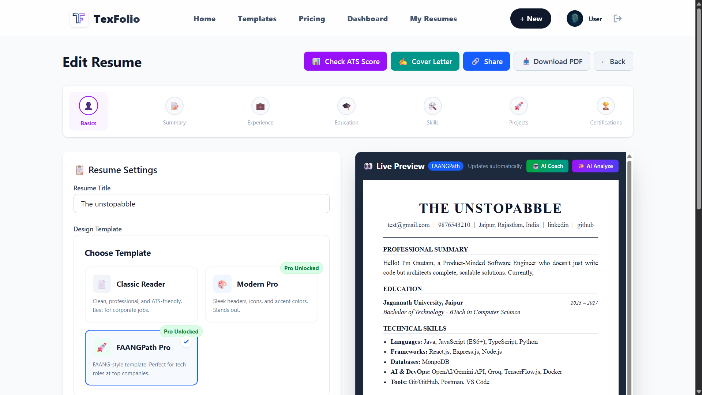
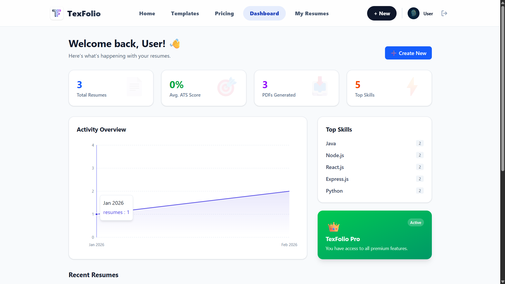
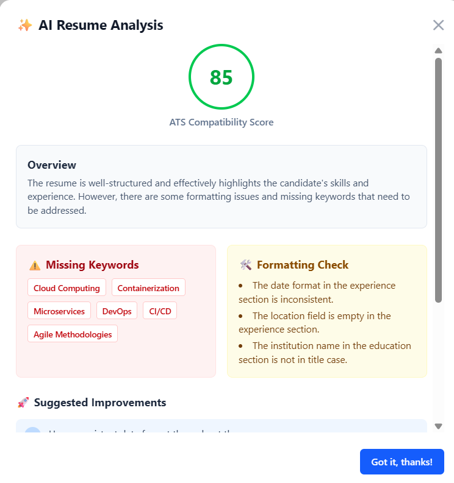
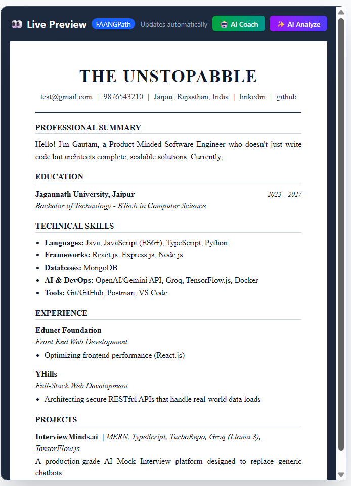

# <div align="center">  </div>

<div align="center">

# TexFolio - AI-Powered LaTeX Resume Builder

[](https://texfolio.vercel.app/)
[](LICENSE)
[](apps/web)
[](apps/api)
[](apps/api/src/agents)
[](apps/api/src/queues)
[](apps/api/src/middleware.hono)
[](apps/api/src/routes.hono)

**Build professional, ATS-friendly resumes in minutes with the power of LaTeX rendering and AI assistance.**

[Features](#-features) • [Tech Stack](#-tech-stack) • [Getting Started](#-getting-started) • [Architecture](#-architecture) • [API Documentation](#-api-documentation) • [RBAC](#-rbac--organizations) • [GDPR](#-gdpr-compliance) • [Contributing](#-contributing)

</div>

---

## 🚀 Overview

**TexFolio** is a modern SaaS application that combines the precision of LaTeX document rendering with the intelligence of Large Language Models (LLMs). It solves the problem of formatting complex resumes while ensuring they are optimized for Applicant Tracking Systems (ATS).

Unlike traditional resume builders that generate clunky HTML-to-PDF exports, TexFolio compiles real LaTeX code in the background to produce industry-standard, typography-perfect PDFs.

## ✨ Features

### 🤖 AI-Powered Intelligence

- **LangGraph Resume Coach:** Multi-agent pipeline scoring Content, Impact, Format, and ATS compatibility.
- **Smart Resume Analysis:** Get real-time feedback on your resume with a 0-100 ATS score.
- **Bullet Point Generator:** Generate action-oriented, quantified bullet points for any job title (Powered by NVIDIA NIM / Groq).
- **Text Improver:** Instantly rewrite summary or descriptions to be more professional.
- **Cover Letter Generator:** Auto-write tailored cover letters based on your resume and a job description.
- **LinkedIn Import:** Upload your LinkedIn PDF and let Llama 3.3 automatically extract and populate your resume data.

### 📄 LaTeX Precision

- **Real LaTeX Rendering:** Uses `pdflatex` to compile high-quality PDFs.
- **FAANG-Ready Templates:** Includes the popular "FAANGPath" and "Classic" templates used by top tech companies.
- **Clean URLs:** Automatic formatting of LinkedIn and GitHub links for a cleaner look.

### 🛠️ Powerful Editor

- **Interactive Stepper:** A guided, step-by-step form experience.
- **Drag & Drop:** Easily reorder sections (Education, Experience, Skills, etc.).
- **Live Preview:** Real-time feedback on your edits as you type. ✨

### 🏢 Organizations & RBAC

- **Multi-Organization Support:** Create and manage teams with shared resume access.
- **Role-Based Access Control (RBAC):** `Owner → Admin → Editor → Viewer` hierarchy.
- **Organization Branding:** Lock templates, enforce company fonts, and set primary colors.
- **Member Invitations:** Invite users with scoped roles; ownership transfer support.
- **Org-Aware Resumes:** Resumes with `visibility: "organization"` are shared across the team.
- **Audit Logging:** Immutable trail for all membership changes and organization actions.

### 📡 Enterprise Infrastructure

- **Queue-Based PDF Generation:** BullMQ + Redis offloads LaTeX compilation from the HTTP thread.
  - Progress tracking (10% → 30% → 100%)
  - Automatic retries with exponential backoff
  - Rate-limited worker concurrency (5 PDFs/min)
- **Distributed Rate Limiting:** Redis-backed fixed-window counters survive reboots and scale horizontally.
- **Health Monitoring:**
  - `/health` — API liveness
  - `/health/ai` — AI circuit breaker status + key configuration
  - `/health/pdf` — PDF pipeline (pdflatex + Redis) readiness
- **Circuit Breaker:** Automatic AI service failover (NVIDIA NIM → Groq) with configurable thresholds.
- **Request ID Tracking:** Every request traceable from client to server with correlation IDs.
- **Structured Logging:** JSON-serialized logs for observability.

### 🔐 Security & Compliance

- **Authentication:** Clerk JWT with strict middleware + Zod config validation.
- **API Key Authentication:** Service-to-service HMAC-signed keys with scoped permissions (`read:resumes`, `write:resumes`, `admin`).
- **Input Sanitization:** XSS/prototype pollution prevention on all JSON inputs.
- **Rate Limiting:** Tiered limits — Pro users get higher quotas; anonymous requests fall back to IP.
- **Security Headers:** CSP, X-Frame-Options, nosniff, referrer policy, and X-Request-ID enforced.
- **Payments:** Razorpay with cryptographic webhook signature validation.
- **Email Delivery:** Brevo API for one-click PDF sharing.
- **GDPR Compliance:**
  - `/api/me/export` — Complete JSON dump of all personal data
  - `/api/me/delete` — Soft-delete with 30-day buffer and PII anonymization
- **Database:** MongoDB Atlas with connection pooling, compound indexes, and transaction support.
- **CI/CD:** GitHub Actions for automated security audits + TypeScript build verification.

---

## 📸 Screenshots

|                   **Interactive Editor**                   |                          **Dashboard**                           |
| :--------------------------------------------------------: | :--------------------------------------------------------------: |
|  |  |

|                       **AI Analysis**                       |                         **PDF Preview**                          |
| :---------------------------------------------------------: | :--------------------------------------------------------------: |
|  |  |

> _Note: Add your screenshots to a `docs/` folder in the root directory._

---

## 🛠️ Tech Stack

### Frontend (`apps/web`)

- **Core:** React 19, Vite (Rolldown bundler), TypeScript
- **Styling:** Tailwind CSS v4
- **State Management:** Zustand (with persist), React Query (@tanstack/query)
- **Organization Context:** Zustand store (`organizationStore`) + `OrganizationContext` provider for active-org resolution, role-aware UI guards, and `X-Organization-Id` header injection
- **Forms:** React Hook Form
- **UI Components:** Headless UI, Lucide React
- **Authentication:** Clerk React SDK

### Backend (`apps/api`)

- **Server:** Hono v4 (Node.js adapter) — Ultra-fast web standard framework with middleware pipeline
- **Database:** MongoDB (Mongoose) with connection pooling, compound indexes, and multi-document transactions
- **AI Engine:** LangChain + LangGraph (Resume Coach Agent with 4-stage pipeline)
- **LLM Providers:** NVIDIA NIM (Primary), Google Gemini, Groq (Fallback chain)
- **PDF Engine:** `pdflatex` via Docker container (`texfolio-latex`) or local MiKTeX, with `spawn`-based command injection prevention
- **Job Queue:** BullMQ backed by Redis for async PDF generation with progress tracking, retries, and worker concurrency limits
- **Rate Limiting:** Distributed fixed-window counters via `ioredis` (survives restarts, scales horizontally)
- **Caching:** Redis for session-adjacent data and queue state
- **Integrations:** Razorpay (Payments), Brevo (Emails), Clerk (Auth)
- **Middleware:** Request ID propagation, tiered rate limiting, Clerk JWT auth, RBAC role enforcement, API key auth (HMAC), structured logging, CORS, CSP
- **CI/CD:** GitHub Actions with automated security audits + TypeScript build verification

---

## 🚀 Getting Started

Follow these steps to set up TexFolio locally.

### Prerequisites

- Node.js >= 18
- MongoDB (Local or Atlas)
- Redis (Local or Docker) — Required for BullMQ queues and distributed rate limiting
- LaTeX Distribution (MiKTeX or TeX Live) OR Docker (for containerized `pdflatex` rendering) — _Recommended_
- Groq API Key (for AI features)
- Clerk API Keys (for Auth)

### Installation

1. **Clone the repository**

   ```bash
   git clone https://github.com/theunstopabble/TexFolio.git
   cd TexFolio
   ```

2. **Install Dependencies**

   ```bash
   npm install
   ```

3. **Environment Setup**
   Copy `.env.example` files and fill in your keys:
   
   ```bash
   cp apps/api/.env.example apps/api/.env
   cp apps/web/.env.example apps/web/.env
   ```

   **`apps/api/.env`**

   ```env
   # Core
   NODE_ENV=development
   PORT=5000
   MONGODB_URI=your_mongodb_connection_string
   REDIS_URL=redis://localhost:6379
   CORS_ORIGIN=http://localhost:5173

   # Auth
   CLERK_SECRET_KEY=your_clerk_secret_key
   CLERK_PUBLISHABLE_KEY=your_clerk_publishable_key

   # AI (at least one required)
   NVIDIA_API_KEY=your_nvidia_nim_key
   GROQ_API_KEY=your_groq_api_key
   GOOGLE_AI_API_KEY=your_google_gemini_key

   # PDF (set to true if using Docker for LaTeX)
   PDFLATEX_PATH=pdflatex
   USE_DOCKER_LATEX=true

   # Payments
   RAZORPAY_KEY_ID=your_razorpay_key_id
   RAZORPAY_KEY_SECRET=your_razorpay_secret
   RAZORPAY_WEBHOOK_SECRET=your_razorpay_webhook_secret

   # Email
   BREVO_API_KEY=your_brevo_api_key
   SENDER_EMAIL=hello@texfolio.app

   # Service-to-Service API Keys (optional but recommended)
   API_KEY_SECRET=your_random_64_char_secret_for_hmac_signing
   ```

   **`apps/web/.env`**

   ```env
   VITE_API_URL=http://localhost:5000/api
   VITE_CLERK_PUBLISHABLE_KEY=your_clerk_publishable_key
   ```

4. **Run the Application**
   Run both frontend and backend concurrently:

   ```bash
   npm run dev
   ```

   - Frontend: `http://localhost:5173`
   - Backend: `http://localhost:5000`

---

## 🏗️ Architecture

TexFolio follows a **Service-Oriented Architecture** within a Monorepo.

```
TexFolio/
├── apps/
│   ├── api/                          # Backend Server (Hono)
│   │   ├── src/
│   │   │   ├── services/             # Business Logic (AI, PDF, Audit, Org)
│   │   │   ├── templates/            # .tex LaTeX Templates
│   │   │   ├── models/               # Mongoose Models (User, Resume, Org, AuditLog, ApiKey)
│   │   │   ├── routes.hono/          # REST API Endpoints
│   │   │   ├── middleware.hono/      # Auth, RBAC, Rate Limit, API Key, Audit
│   │   │   ├── queues/               # BullMQ Workers (PDF Generation)
│   │   │   ├── config/               # Environment validation (Zod)
│   │   │   └── agents/               # LangGraph AI pipelines
│   │   └── Dockerfile                # API container
│   ├── web/                          # Frontend Client (React)
│   │   └── src/
│   │       ├── features/             # Feature-based folders (Resume Editor)
│   │       ├── components/           # Shared Components (Header, OrgSwitcher)
│   │       ├── context/              # React Context (Auth, Organization)
│   │       ├── stores/               # Zustand Stores (UI, Organization)
│   │       └── pages/                # Route Views (Home, Dashboard, Orgs, Editor)
│   └── latex-renderer/
│       └── Dockerfile                # Dedicated LaTeX compilation container
├── packages/
│   └── shared/                       # Shared TypeScript types/config
├── docker-compose.yml                # Full stack orchestration (API + LaTeX + Redis)
└── .github/workflows/ci.yml          # CI/CD pipeline
```

### PDF Generation Pipeline (Async via BullMQ)

1. **Request Arrival:** Client requests PDF generation (`/api/resumes/:id/pdf`).
2. **Job Enqueue:** Server enqueues a BullMQ job with `resumeId`, `userId`, and optional `organizationId`.
3. **Progress Tracking:** Client polls `/api/resumes/:id/pdf-status` for job progress (10% → 30% → 100%).
4. **Worker Processing:** Dedicated worker fetches resume + org branding (template lock, color, font overrides).
5. **Transformation:** `PDFService` escapes LaTeX, applies org branding, and maps to Mustache tags.
6. **Compilation:** `pdflatex` (Docker or local) compiles `.tex` → `.pdf` with `spawn` (no `exec`).
7. **Delivery:** Worker returns the output path; client receives download URL.

### RBAC Resolution Flow

```
Request → authMiddleware (Clerk JWT)
  → Resolve X-Organization-Id header or route param
  → Fetch OrganizationMember (role lookup)
  → requireRole("admin") middleware
  → ResumeService.orgQuery({ userId, orgId, role })
  → AuditService.log({ actorId, action, resourceType })
  → Response
```

### Frontend Organization Integration

```
App.tsx
  → OrganizationProvider (context)
    → organizationStore (Zustand, persist)
      → Header: OrganizationSwitcher dropdown
      → Dashboard: org context banner + CTA
      → /organizations        → Organizations.tsx    (list, create)
      → /organizations/:id    → OrganizationDetail.tsx (overview, resumes)
      → /organizations/:id/settings → OrganizationSettings.tsx (branding, locked template)
      → /organizations/:id/members  → OrganizationMembers.tsx (invite, roles, remove)
      → API calls → Axios interceptor injects X-Organization-Id header dynamically
```

### Distributed Rate Limiting

- **Storage:** Redis fixed-window counters via `INCR` + `PEXPIRE` (atomic pipeline).
- **Keys:** `ratelimit:user:<userId>:<windowId>` or `ratelimit:ip:<ip>:<windowId>`.
- **Tiers:** Pro users get higher quotas; anonymous requests fall back to IP.
- **Fail-Open:** If Redis is unreachable, requests are allowed (prevent total outage).
- **Headers:** `X-RateLimit-Limit`, `X-RateLimit-Remaining`, `X-RateLimit-Reset`, `X-RateLimit-Tier`.

---

## 📚 API Documentation

All protected routes strictly require a Clerk `Bearer` token, unless noted otherwise.

### **Resumes API (`/api/resumes`)**

| Method | Endpoint | Auth | Description |
| :----- | :------- | :--- | :---------- |
| `GET` | `/api/resumes` | Clerk | Get all user resumes (personal + org-authorized) |
| `POST` | `/api/resumes` | Clerk | Create a new resume (personal or org-scoped) |
| `GET` | `/api/resumes/:id` | Clerk | Get resume details (ownership or org visibility) |
| `PUT` | `/api/resumes/:id` | Clerk | Update resume (owner, admin, or editor in org) |
| `DELETE` | `/api/resumes/:id` | Clerk | Delete resume (owner or org admin) |
| `GET` | `/api/resumes/:id/pdf` | Clerk | Enqueue PDF generation (returns job ID) |
| `GET` | `/api/resumes/:id/pdf-status` | Clerk | Poll BullMQ job progress (10% → 30% → 100%) |
| `GET` | `/api/resumes/:id/download` | Clerk | Download generated PDF file |
| `POST` | `/api/resumes/:id/email` | Clerk | Email PDF via Brevo |
| `PUT` | `/api/resumes/:id/share` | Clerk | Toggle public visibility + generate shareId |

### **AI Services (`/api/ai` & `/api/agents`)**

| Method | Endpoint | Auth | Description |
| :----- | :------- | :--- | :---------- |
| `POST` | `/api/agents/coach` | Clerk | Full LangGraph ATS & content analysis |
| `POST` | `/api/agents/import/linkedin` | Clerk | Parse and extract data from LinkedIn PDF |
| `POST` | `/api/ai/improve` | Clerk | Improve text (Summary/Description) |
| `POST` | `/api/ai/generate-bullets` | Clerk | Generate action-oriented bullet points |
| `POST` | `/api/ai/cover-letter` | Clerk | Generate tailored cover letter |

### **Organizations API (`/api/organizations`)**

| Method | Endpoint | Role | Description |
| :----- | :------- | :--- | :---------- |
| `POST` | `/api/organizations` | Any | Create org (becomes owner) |
| `GET` | `/api/organizations` | Any | List your orgs with roles |
| `GET` | `/api/organizations/:id` | Member | Get org details |
| `PUT` | `/api/organizations/:id` | Admin+ | Update branding, settings |
| `DELETE` | `/api/organizations/:id` | Owner | Delete org + cleanup |
| `GET` | `/api/organizations/:id/members` | Member | List members |
| `POST` | `/api/organizations/:id/members` | Admin+ | Invite member (admin/editor/viewer) |
| `PUT` | `/api/organizations/:id/members/:userId` | Admin+ | Change role (supports ownership transfer) |
| `DELETE` | `/api/organizations/:id/members/:userId` | Admin+ / Self | Remove member |
| `GET` | `/api/organizations/:id/resumes` | Member | List all org-visible resumes |

> **Organization context** is resolved via `X-Organization-Id` header or inferred from route params.

### **API Keys (`/api/api-keys`)**

| Method | Endpoint | Auth | Description |
| :----- | :------- | :--- | :---------- |
| `POST` | `/api/api-keys` | Clerk | Generate HMAC-signed service key (shown once) |
| `GET` | `/api/api-keys` | Clerk | List active keys (metadata only) |
| `DELETE` | `/api/api-keys/:id` | Clerk | Revoke a key |

> **Usage:** Include key in `X-API-Key` header or `Authorization: ApiKey <key>`.
> Supported scopes: `read:resumes`, `write:resumes`, `read:analytics`, `admin`.

### **GDPR & Data (`/api/me`)**

| Method | Endpoint | Auth | Description |
| :----- | :------- | :--- | :---------- |
| `GET` | `/api/me/export` | Clerk | Full JSON dump (resumes, audit logs, orgs, memberships) |
| `POST` | `/api/me/delete` | Clerk | Soft-delete: anonymize PII, revoke memberships, 30-day buffer |

### **Audit Logs (`/api/audit-logs`)**

| Method | Endpoint | Auth | Description |
| :----- | :------- | :--- | :---------- |
| `GET` | `/api/audit-logs` | Clerk | Query immutable audit trail (actor, action, resourceType, date range) |

### **Payments (`/api/payments`)**

| Method | Endpoint | Auth | Description |
| :----- | :------- | :--- | :---------- |
| `POST` | `/api/payments/create-order` | Clerk | Create Razorpay order |
| `POST` | `/api/payments/verify` | Clerk | Verify payment signature and upgrade to Pro |

### **Health Checks (Public)**

| Method | Endpoint | Description |
| :----- | :------- | :---------- |
| `GET` | `/health` | API liveness |
| `GET` | `/health/ai` | AI circuit breaker status + key configuration |
| `GET` | `/health/pdf` | PDF pipeline readiness (pdflatex + Redis) |

---

## 🏛️ RBAC & Organizations

TexFolio supports multi-tenant organizations with strict role-based access control.

### Role Hierarchy

```
Owner (4)  →  Admin (3)  →  Editor (2)  →  Viewer (1)
```

| Role | Create Resumes | Edit Any Org Resume | Delete Resumes | Manage Members | Update Org Settings | Delete Org |
| :--- | :------------ | :------------------ | :------------ | :------------ | :------------------ | :--------- |
| **Owner** | ✅ | ✅ | ✅ | ✅ | ✅ | ✅ |
| **Admin** | ✅ | ✅ | ✅ | ✅ | ✅ | ❌ |
| **Editor** | ✅ | ✅ | ❌ | ❌ | ❌ | ❌ |
| **Viewer** | ❌ | Read-only | ❌ | ❌ | ❌ | ❌ |

### Organization Branding

When `visibility: "organization"` is set on a resume:
- All members can view it.
- Admins and Editors can modify it.
- PDF generation automatically applies the org's `lockedTemplateId`, `primaryColor`, and `enforceCompanyFont` overrides.

### Ownership Transfer

Only the current owner can promote another member to `owner`. The previous owner is automatically demoted to `admin`.

---

## 🛡️ GDPR Compliance

TexFolio implements a privacy-by-design approach for EU GDPR compliance.

### Right to Data Portability (`/api/me/export`)

Returns a complete JSON dump containing:
- All personal resumes
- Audit log history
- Organizations owned
- Organization memberships

### Right to Erasure (`/api/me/delete`)

- **Resumes:** Titles, names, emails, phones, locations, and all content sections are replaced with `[REDACTED]` or `[DELETED]`.
- **Organization Memberships:** Status changed to `pending` (effectively revoked).
- **Audit Logs:** Actor IDs anonymized with `[DELETED:<userId>]` marker.
- **Hard Deletion:** A background job (not yet automated) should permanently remove records after a 30-day buffer.

---

## 🤝 Contributing & Contact

Contributions are welcome! Please feel free to submit a Pull Request.

**Author:** [Gautam Kumar](https://gautam-kr.vercel.app) 
**LinkedIn:** [Linkedin](https://www.linkedin.com/in/gautamkr62/)  
**Website:** [Texfolio](https://texfolio.vercel.app/)

---

<div align="center">
  <sub>Built with ❤️ using React, Node.js, and LaTeX.</sub>
</div>
